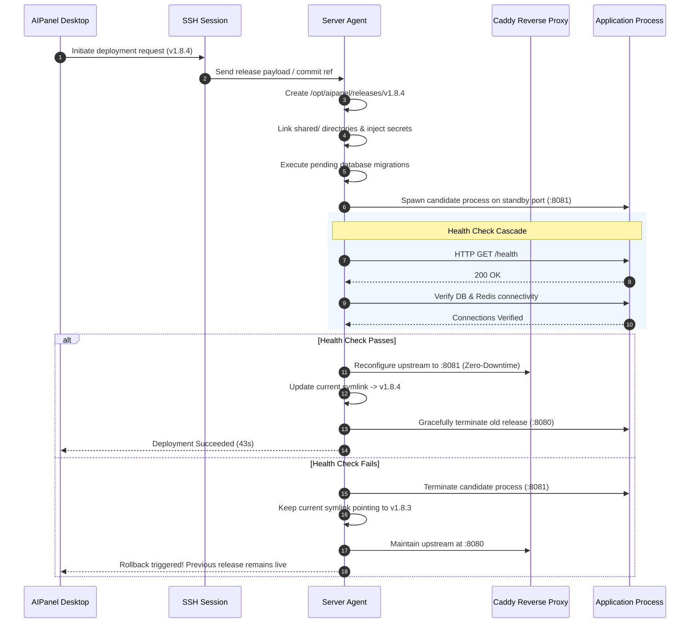

# Architecture: Deployment Engine & Rollback Mechanics

The AIPanel Deployment Engine provides atomic, zero-downtime releases with automated health verification and instant rollback.

---

## 1. Directory Structure on Server

AIPanel deploys each release as an immutable directory tree on the target host:

```
/opt/aipanel/
├── current -> /opt/aipanel/releases/v1.8.4   # Active release symlink
├── releases/
│   ├── v1.8.2/                             # Old release (kept for instant rollback)
│   ├── v1.8.3/                             # Previous release
│   └── v1.8.4/                             # Current live release
├── shared/
│   ├── storage/                            # Persistent uploads / assets
│   ├── logs/                               # Consolidated log files
│   └── .env                                # Injected environment secrets
└── agent/
    ├── aipanel-agent                       # Rust server daemon binary
    └── config.toml
```

---

## 2. The Deployment Pipeline



---

## 3. Health Check Cascade

Before live traffic is routed to a newly deployed version, the AIPanel Agent executes a 4-tier verification cascade:

1. **HTTP Liveness**: Performs HTTP `GET` against `/health` (or configured health check endpoint) expecting `200 OK` within timeout.
2. **Database Query Readiness**: Tests database query latency and verifies migration integrity.
3. **Cache & Queue Connectivity**: Checks Redis connectivity and verifies queue worker readiness.
4. **Memory & Crash Loop Check**: Ensures process does not terminate or leak memory during the initial 10 seconds of startup.

---

## 4. Rollback Mechanics

If an application exception triggers post-deployment:
- An operator clicks **"Rollback"** in AIPanel (or CLI: `aipanel rollback`).
- The Agent updates the symlink or container routing back to `v1.8.3` within **< 500ms**.
- Caddy reloads configuration in memory without dropping in-flight HTTP connections.
