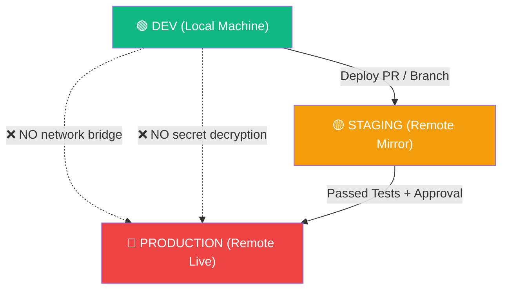

# Architecture: Environment Engine & Isolation

The foundational security guarantee of AIPanel is:
> **DEV can NEVER accidentally modify LIVE.**

This document details the architectural boundaries that enforce this rule at the code, process, network, and data levels.

---

## 1. Environment Tiers

### DEV (Local Workspace)
- **Execution Target**: Local developer machine host runtimes or local Docker Desktop daemon.
- **Data Target**: Ephemeral test database containers or local SQLite.
- **Safety Posture**: Permissive. Rapid hot reloading, unrestrained file edits, mock payment webhooks, debug logging.

### STAGING (Remote Validation)
- **Execution Target**: Dedicated remote server / container instance mirroring production topology.
- **Data Target**: Sanitized staging database, seeded with scrubbed production-like datasets.
- **Safety Posture**: Automated testing target. Verified via continuous integration and branch preview URLs.

### PRODUCTION (Live Environment)
- **Execution Target**: Hardened production servers/containers behind Caddy reverse proxy.
- **Data Target**: Live production database with automated PITR (Point-in-Time Recovery) snapshots.
- **Safety Posture**: Zero ad-hoc edits. Read-only audit logs. All deployments must pass pre-flight checks and manual approval gates.

---

## 2. Hard Isolation Mechanisms

### A. Network Layer Isolation
- **No Shared Docker Networks**: Local development containers reside on an isolated bridge network (`aipanel_dev_net`). They cannot communicate with production VPCs or databases.
- **Explicit Port Binding**: Dev services bind strictly to `127.0.0.1` unless exposed via explicit, token-authorized Cloudflare Tunnels.

### B. Secret Vault Isolation
- Each environment possesses a segregated secret store encrypted with **AES-256-GCM**.
- **Master Key Derivation**:
  - DEV vault key is generated from local machine hardware identity.
  - Production vault key is stored in server-side secure keystores (or hardware security modules) and is never transmitted down to the developer desktop client.
- The desktop IDE cannot decrypt production credentials directly; it can only request the remote agent to inject secrets into a new release candidate.

### C. Process Isolation
- Production processes run under dedicated non-privileged system users (e.g., `aipanel-app`) with restricted capabilities (`NoNewPrivileges=true`, restricted filesystem view).

### D. UI/Visual Safeguards
- When switched to the **PRODUCTION** context in AIPanel:
  - Top navigation and window title bar take on a prominent red indicator.
  - Dangerous actions (e.g. drop table, force rebuild, service kill) require typing the environment name or passing secondary biometric/approval verification.
